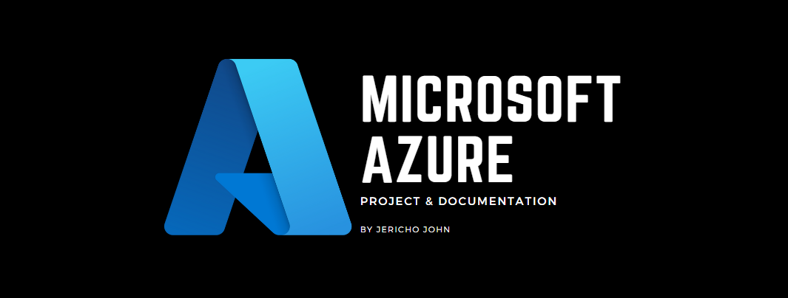
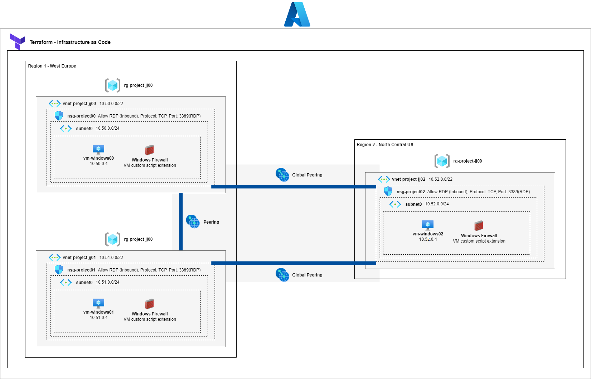
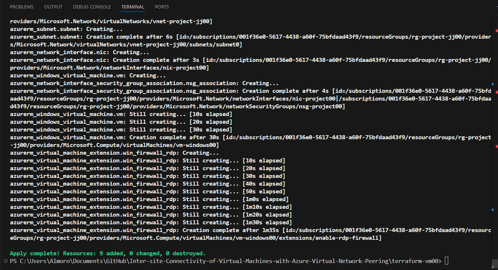

<h1 align="center" style="display: block; font-size: 2.5em; font-weight: bold; margin-block-start: 1em; margin-block-end: 1em;">
Inter-site Connectivity of Virtual Machines with Azure Virtual Network Peering
</h1>

<div align="center">
    
    
    <br>
    
    <br>
    
    
</div>

## Description

This project involves implementing an on-premises infrastructure in Azure for an organization with three datacenters connected via a mesh wide-area network. The setup includes two offices in one Azure region (New York and Boston) and one office in another region (Seattle), all requiring seamless connectivity for information sharing. The focus of this simulation is on establishing the network connectivity between the offices, rather than creating individual Azure resources.

## Architecture Diagram



## Requirements

- Management group
- Subscription
- Virtual Machine (Free credit or Own expense)

## Objectives

- **Step 1: Create the infrastructure environment**
- **Step 2: Configure local and global virtual network peering**
- **Step 3: Test inter-site connectivity between virtual machines on the three virtual networks**

### Step 1: Create the infrastructure environment

- Make sure to have Terraform (IaC) and Azure CLI Installed

  - https://developer.hashicorp.com/terraform/tutorials/azure-get-started/install-cli
  - https://learn.microsoft.com/en-us/cli/azure/install-azure-cli

- From the diagram, let’s create the first and second virtual machine along with the virtual network and subnet. (Note: The last virtual machine will have different configuration)

- Virtual Machines (**vm-windows00 and vm-windows01)**
  Use the terraform to apply the Infrastructure as Code. This make things easier by doing **`terraform init`** and then apply the changes: **`terraform apply`**
  _Note: You can improve the IaC by looping through instead of different IaC files_
- After doing the commands above (do this also for vm-windows01) this will successfully create the virtual machine

  

- For the third Virtual Machine (**vm-windows01**), the **`vars.tf`** resource location is set to **North Central US**, while the previous configuration are based in **West Europe**
  

### Step 2: **Configure local and global virtual network peering**

- Navigate to **`vnet-project-jj00`**

  

- Go to **Peerings** and click on **Add**

  

- Configure the settings as shown below and then click on **Add**:

  

  

- Do the same for connecting **`vnet-project-jj00`** to **`vnet-project-jj02`**

  

- The result should be a fully synchronized peering sync status and connected peering state
  Note: Do the same for **`vnet-project-jj01`**(refer to the diagram) because **`vnet-project-jj02`** has already the peer connectivity with previous configurations.
  

### Step 3: **Test inter-site connectivity between virtual machines on the three virtual networks**

- Navigate to Virtual Machines from the search bar and go to **`vm-windows00`**

  

- Open the downloaded file and connect through RDP
  
- This will ask for user password, make sure to input the password you have created from **`main.tf` (**after this, the prompt will ask if you should connect, click on connect)
  
- After a successful connection, go to Powershell (run as administrator) and type the command:

  ```powershell
  Test-NetConnection -ComputerName 10.51.0.4 -Port 3389 -InformationLevel 'Detailed'
  ```

  This will ping and test the connectivity between **`vm-windows00`** and **`vm-windows01`**

  

  Test the connectivity between **`vm-windows00`** and **`vm-windows02`**

  

- Test the connectivity for **`vm-windows01`**

  Test the connectivity between **`vm-windows01`** and **`vm-windows00`**

  

  Test the connectivity between **`vm-windows01`** and **`vm-windows02`**

  

- Test the connectivity for **`vm-windows02`**
  Test the connectivity between **`vm-windows02`** and **`vm-windows00`**
  
  Test the connectivity between **`vm-windows02`** and **`vm-windows01`**
  

### Now, on to the last step:

- If you’d like to save on costs from Azure, you can either set up a budget or clean up the whole infrastructure with the help of terraform
- For terraform, you can delete each VM and its resources (vnet, subnet, disk, etc) by executing **`terraform destroy`** as this will cleanup the infrastructure for you in a single command (saves you time and effort from manually deleting everything)
